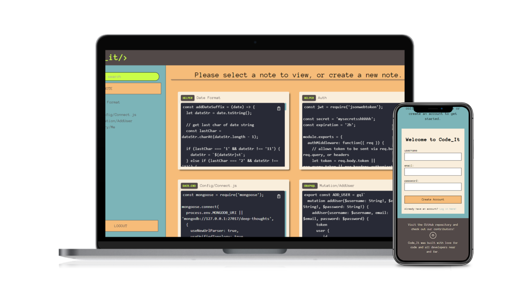

# Code-It
  
  <div align="center">
  
  </div>

  
  

  ## Description
  Code_It is a noting-taking app made especially for your code. When you create a note, you can add code snippets and personal notations. You can also edit, delete, and share them at any time. Create folders to set up an organized directory or keep your notes in a random, piled collection. This application was made with GraphQL, React, MongoDB, Express.js, TailwindCSS, and JSX.

  
  ## Preview
  


  ## Table of Contents
  - [Installation](#installation)
  - [Usage](#usage)
  - [Credits](#credits)
  - [Tests](#tests)
  - [Questions](#questions)
  - [License](#license)

  ## Installation
  ```npm i``` <br />
  ```npm run develop``` <br />
  macOS: Make sure Mongod is running.

  ## Usage
  Note Taking for Developers.

  ## Credits
  Jason Whitney, Ally Garcia, and Max Cain.

  ## Tests
  No tests available at this time.

  ## Contributors
  Checkout Max's GitHub: [pixiepucker!](https://github.com/pixiepucker)
  and Ally's GitHub: [allygarcia152!](https://github.com/allygarcia152)

  ## License
  
  This application is licensed by [MIT](https://opensource.org/licenses/MIT)
